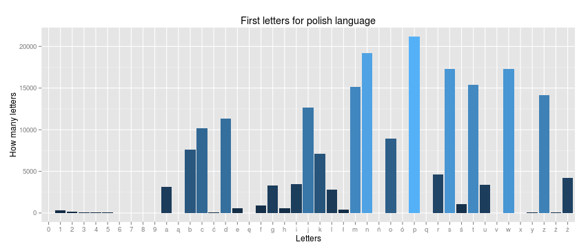

```
Sprzęt: 
Laptop ACER ASPIRE ONE 5820TG
Procesor: Intel core I5-430M
Ilość pamięci RAM: 8 GB
Dysk twardy: SSD SanDisk 128 GB
System Operacyjny: Linux Mint 17 x64
Wersja MongoDB: 2.6.5 oraz 2.8.0.rc0
```
## Tytuł: Użycie Map Reduce w MongoDB do sprawdzenia rozkładów liter w sentencjach polskich i angielskich

### Motywacja

Coraz częściej słyszymy o atakach na różne serwisy www oraz o nieodpowiedzialności administratorów, którzy mają bardzo słabe hasła. 
Jak stworzyć silne hasło: jest opinia, która mówi że należy wymyśleć sobie jakieś zdanie i za hasło wziąść pierwsze litery wyrazów w tym zdaniu. Eksperyment, który przeprowadziłem sprawdził czy ta metoda ma sens poprzez sprawdzenie czy hasła są unikalne to znaczy czy są zdania które posiadają ten sam rozkład liter.
Poza tym zastanowić się można jak można ulepszyć tą metodę. 

Nasuwają się następujące pytania: 
- Czy usunięciu ```stop-słów``` zwiększa unikalność haseł.
- Czy posortowanie liter w rozkładzie zwiększy nieunikalność haseł.

### Przygotowanie danych

Do przeprowadzenia eksperymentu użyłem pliku ```sentences.tar.bz2``` ze strony [tatoeba.org](http://downloads.tatoeba.org/exports/sentences.tar.bz2) która zawiera plik z popularnymi sentencjami w różnych językach świata. Nas będzie interesował język **angielski** oraz **polski**.

#### Przetworzenie danych ze strony tatoeba.org

Ponieważ plik ze strony **tatoeba.org** zawiera sentencje w wielu językach świata musimy przerobić i wydzielić do innych plików sentencje polskie i angielskie.
Następnie dane musimy załadować do MongoDB.
Fragment otrzymanego pliku: 
```
...
5131  jpn	2006年上海では15万組の夫婦が結婚すると予想されている。
5132	jpn	ニジェールでは50万人もの子供たちが未だ栄養失調に直面している。
...
53010  eng	Judy is a most clever student.
53011	 eng	Judy is fond of dancing.
...
```
Do przetworzenia danych należy uruchomić skrypt **PrepareData.sh**, ktory:
- Pobiera plik ze strony **tatoeba.org**
- Rozpakowuje plik do folderu **data**
- Wywołuje skrypt napisany w **awk** który eksportuje sentencje w danym języku
- Usuwa znak "," z sentencji oraz usuwa powtarzające się linie.
Kod skryptu przetwarzającego dane: 
```bash
#!/bin/bash

#Prepare data and load to MongoDB
wget -O ../data/sentences.tar.bz2 http://downloads.tatoeba.org/exports/sentences.tar.bz2
tar xvf ../data/sentences.tar.bz2 -C ../data/

./convert.awk "eng" ../data/sentences.csv > ../data/english1.csv
./convert.awk "pol" ../data/sentences.csv > ../data/polish1.csv

#Remove comma from files
tr -d "," < ../data/english1.csv > ../data/english2.csv
tr -d "," < ../data/polish1.csv > ../data/polish2.csv

#Remove duplicate lines in file
awk '!x[$0]++' ../data/english2.csv > ../data/english.csv
awk '!x[$0]++' ../data/polish2.csv > ../data/polish.csv

#Remove temporary files
rm ../data/english1.csv
rm ../data/english2.csv
rm ../data/polish1.csv
rm ../data/polish2.csv
rm ../data/sentences.tar.bz2
```
#### convert.awk
Plik ze strony **tatoeba.org** jeśli chodzi o język angielski zawiera błędy, które polegają na tym że językowi temu przydzielone zostały sentencje napisane w języku arabskim. Dlatego też w skrypcie są zawarte numery 3670301 itd., które zawierają te nieprawidłowe linie. 
Poza tym eksportuje tylko te sentencje, które zawierają od 6 do 12 słów.

Kod skryptu napisanego w **awk**:
```awk
#!/usr/bin/awk -f
BEGIN{
  if (ARGC<3) exit(1);
    arg=ARGV[1];
    ARGV[1]="";
}
($2 == arg && $1 != 3670301 && $1 != 3712889 && $1 != 3712890) {
  out=$3;
  for(n=4;n<=NF;n++){
    out=out " " $n;
  }
  if(NF >= 8 && NF <= 14){
    printf("%s\n",out);
  }
}
```

#### Załadowanie danych do MongoDB.

Do załadowania danych należy użyć skryptu **LoadData.sh** z folderu **bash_scripts**. Skrypt ten używa innego skryptu napisanego w języku R, o nazwie **PrepareData.R** dzięki któremu ładowane są dane do **MongoDB**. 

```bash
#!/bin/bash

#Load data to MongoDB
echo "Load Polish sentences to test.polishSentences"
Rscript ../r_scripts/PrepareData.R ../data/polish.csv 10000 test.polishSentences
echo "Load English sentences to test.englishSentences"
Rscript ../r_scripts/PrepareData.R ../data/english.csv 10000 test.englishSentences

```

Dane zostały zapisane odpowiednio w kolekcjach: **polishSentences** oraz **englishSentences**.

### MapReduce w sentencjach polskich i angielskich.

#### Rozkład występowania pierwszych liter vs rozkład występowania wszystkich liter

Bierzemy tu pod uwagę wyłącznie małe litery + cyfry.
Aby obliczyć powyższe rozkłady należy uruchomić w konsoli mongo skrypty **lettersPol.js** oraz **lettersEng.js**.

Wykres występowań liter dla języka polskiego: 



Najczęstsze 3 litery występujących na pierwszej pozycji: 
```js
{
  "_id": "p",
  "value": 21674
}
{
  "_id": "n",
  "value": 21268
}
{
  "_id": "w",
  "value": 20671
}
```
Najczęstsze 3 litery występujących na wszystkich pozycjach: 
```js
{
  "_id": "i",
  "value": 90984
}
{
  "_id": "e",
  "value": 90671
}
{
  "_id": "a",
  "value": 87216
}
```

Wykres wykres występowań liter dla języka angielskiego: 


Najczęstsze 3 litery występujących na pierwszej pozycji: 
```js
{
  "_id": "t",
  "value": 462360
}
{
  "_id": "i",
  "value": 224958
}
{
  "_id": "a",
  "value": 201324
}
```
Najczęstsze 3 litery występujących na wszystkich pozycjach: 
```js
{
  "_id": "e",
  "value": 1135093
}
{
  "_id": "t",
  "value": 954772
}
{
  "_id": "o",
  "value": 863300
}
```
#### Zapisanie rozkładów liter do kolekcji - split.js

Kod pliku:
```js
polishCollection = db.polishSentences;
englishCollection = db.englishSentences;

map = function(){
  var split = this.originalText.match(/\b\w/g);
  var result = split.join("");
    emit(result,1);
};

reduce = function(key,values){
  return Array.sum(values);
};

var resultPolish = polishCollection.mapReduce(map, reduce, {out: "resultPol"});
printjson(resultPolish);
var resultEnglish = englishCollection.mapReduce(map, reduce, {out: "resultEng"});
printjson(resultEnglish);
```
Wynik:
```js
{
  "result" : "resultPol",
	"timeMillis" : 1566,
	"counts" : {
		"input" : 27934,
		"emit" : 27934,
		"reduce" : 162,
		"output" : 27771
	},
	"ok" : 1
}
{
	"result" : "resultEng",
	"timeMillis" : 16371,
	"counts" : {
		"input" : 301120,
		"emit" : 301120,
		"reduce" : 7696,
		"output" : 292684
	},
	"ok" : 1
}
```
Podgląd do bazy, który otrzymaliśmy: 
```js
{
  "_id": "11111111112",
  "value": 1
}
{
  "_id": "1dwTcnw",
  "value": 1
}
{
  "_id": "Amepjdkdw",
  "value": 2
}
{
  "_id": "BdmotpzT",
  "value": 2
}
```

#### Zapis do kolekcjiw której będą zapisane sentencję - splitWithSentence.js.

Powyższa baza niewiele nam mówi bo nie mamy przedewszystkim jakie zdanie mają dany rozkład, dlatego zmodyfikujemy trochę plik.

Kod pliku:
```js
polishCollection = db.polishSentences;
englishCollection = db.englishSentences;

map = function(){
  var split = this.originalText.match(/\b\w/g);
  var result = split.join("");
    emit(result,{list: [this.originalText],count: 1});
};

reduce = function(key,values){
  var list =  [];
  var count = 0;
  values.forEach(function(item){
    list = item.list.concat(list);
    count += item.count;
  });
  return ({list: list,count: count});
};

var resultPolish = polishCollection.mapReduce(map, reduce, {out: "result2Pol"});
printjson(resultPolish);
var resultEnglish = englishCollection.mapReduce(map, reduce, {out: "result2Eng"});
printjson(resultEnglish);
```
Otrzymany wynik:
```js
{
  "result" : "result2Pol",
	"timeMillis" : 1723,
	"counts" : {
		"input" : 27934,
		"emit" : 27934,
		"reduce" : 159,
		"output" : 27771
	},
	"ok" : 1
}
{
	"result" : "result2Eng",
	"timeMillis" : 19181,
	"counts" : {
		"input" : 301120,
		"emit" : 301120,
		"reduce" : 7668,
		"output" : 292684
	},
	"ok" : 1
}
```
Podgląd do otrzymanej bazy:
```js
{
  "_id": "13itnawIcbr",
  "value": {
    "list": [
      "104-3820 is the number at which I can be reached."
    ],
    "count": 1
  }
}
{
  "_id": "1Fctcbm",
  "value": {
    "list": [
      "1. Finely chop the chicken breast meat."
    ],
    "count": 1
  }
}
{
  "_id": "ADtphi",
  "value": {
    "list": [
      "A DNA test proved her innocence.",
      "A DNA test proved his innocence."
    ],
    "count": 2
  }
}
{
  "_id": "AItoowttiw",
  "value": {
    "list": [
      "Am I the only one who thinks this is weird?",
      "Am I the only one who thinks this is wrong?"
    ],
    "count": 2
  }
}
```

#### Obliczenie unikalnych i nieunikalnych rozkładów - distributions.js.

Jak już widać niektóre rozkłady występują więcej niż 1 raz. Policzmy ile jest takich rozkładów w obu przypadkach.

Kod pliku:
```js
resultPol = db.resultPol;
resultEng = db.resultEng;

map = function(){
    emit("answer",{value: this.value, sum: this.value,notUnique: 0});
};

reduce = function(key,values){
  var a = values[0];
  for(var i=1; i < values.length;i++){
    var b = values[i];
    if(b.value > 1){
      a.notUnique += b.value;
    }
    a.sum += b.value;
  }
  return a;
};

final = function(key,reducedValue){
  var result = {unique: 0,notUnique: 0};
  result.unique = reducedValue.sum - reducedValue.notUnique;
  result.notUnique = reducedValue.notUnique;
  return result;
}
print("Statistic for Polish sentences\n");
var result = resultPol.mapReduce(map, reduce, {out: {inline: 1}, finalize: final});
printjson(result);
print("Statistic for English sentences\n");
var result2 = resultEng.mapReduce(map, reduce, {out: {inline: 1}, finalize: final});
printjson(result2);
```
Otrzymany wynik: 
```js
Statistic for Polish sentences:
{
  "results" : [
		{
			"_id" : "answer",
			"value" : {
				"unique" : 27613,
				"notUnique" : 321
			}
		}
	],
	"timeMillis" : 616,
	"counts" : {
		"input" : 27771,
		"emit" : 27771,
		"reduce" : 278,
		"output" : 1
	},
	"ok" : 1
}
Statistic for English sentences:
{
	"results" : [
		{
			"_id" : "answer",
			"value" : {
				"unique" : 285367,
				"notUnique" : 15753
			}
		}
	],
	"timeMillis" : 6348,
	"counts" : {
		"input" : 292684,
		"emit" : 292684,
		"reduce" : 2927,
		"output" : 1
	},
	"ok" : 1
}
```
#### Obliczenie maximum z występowania rozkładu liter - maxNotUnique.js

Teraz policzymy jaki rozkład liter najczęsciej występuje w sentencjach.

Kod pliku:
```js
polishCollection = db.result2Pol;
englishCollection = db.result2Eng;

map = function () {
    var x = { count : this.value.count , _id : this._id };
    emit("maximum", { max : x } )
}

reduce = function(key,values){
  var res = values[0];
    for ( var i=1; i<values.length; i++ ) {
      if ( values[i].max.count > res.max.count )
         res.max = values[i].max;
    }
    return res;
}

var result = polishCollection.mapReduce(map, reduce, {out: {inline: 1}});
printjson(result);
var result2 = englishCollection.mapReduce(map, reduce, {out: {inline: 1}});
printjson(result2);
```
Otrzymany wynik:
```js
Maximum of polish sentences:
{
  "results" : [
		{
			"_id" : "maximum",
			"value" : {
				"max" : {
					"count" : 4,
					"_id" : "Nmontp"
				}
			}
		}
	],
	"timeMillis" : 952,
	"counts" : {
		"input" : 27771,
		"emit" : 27771,
		"reduce" : 278,
		"output" : 1
	},
	"ok" : 1
}
Maximum of english sentences:
{
	"results" : [
		{
			"_id" : "maximum",
			"value" : {
				"max" : {
					"count" : 20,
					"_id" : "DytTiu"
				}
			}
		}
	],
	"timeMillis" : 9915,
	"counts" : {
		"input" : 292684,
		"emit" : 292684,
		"reduce" : 2927,
		"output" : 1
	},
	"ok" : 1
}
```
Sprawdźmy jakie zdania mają podane rozkłady:
Rozkład **Nmontp**:
```js
{
  "_id": "Nmontp",
  "value": {
    "list": [
      "Nie ma odpowiedzi na twoje pytanie.",
      "Nie musisz odpowiadać na to pytanie.",
      "Nie musisz odpowiadać na te pytania.",
      "Nie mamy odpowiedzi na to pytanie."
    ],
    "count": 4
  }
}
```
Rozkład **DytTiu**:
```js
{
  "_id": "DytTiu",
  "value": {
    "list": [
      "Do you think Tom is ugly?",
      "Do you think Tom is unapproachable?",
      "Do you think Tom is unbiased?",
      "Do you think Tom is unfair?",
      "Do you think Tom is unfriendly?",
      "Do you think Tom is unhappy?",
      "Do you think Tom is uninteresting?",
      "Do you think Tom is unkind?",
      "Do you think Tom is unlucky?",
      "Do you think Tom is unpleasant?",
      "Do you think Tom is unpredictable?",
      "Do you think Tom is unprejudiced?",
      "Do you think Tom is unprincipled?",
      "Do you think Tom is unreliable?",
      "Do you think Tom is unscrupulous?",
      "Do you think Tom is unsociable?",
      "Do you think Tom is untidy?",
      "Do you think Tom is untrustworthy?",
      "Do you think Tom is upbeat?",
      "Do you think Tom is unsophisticated?"
    ],
    "count": 20
  }
}
```
#### Obliczenie ilości samogłosek i spółgłosek w słowach - aeiou.js

Policzymy tu wyłącznie samogłoski angielskie, ponieważ dodatkowe polskie samogłoski rzadko występowały jako pierwsza litera w słowie.

Kod pliku: 
```js
polishCollection = db.polishSentences;
englishCollection = db.englishSentences;

map = function(){
  var sam = 0;
  var spol = 0;
  var split = this.originalText.toLowerCase().match(/\b\w/g);
  var result = split.join("");
  var r = result.match(/[aeiou]/g);
  var s = result.match(/[^aeiou]/g);
  if(r){
    sam = r.length;
  }
  if(s){
    spol = s.length;
  }
  emit("answer",{samo: sam,spol: spol});
};

reduce = function(key,values){
  var a = values[0];
  for(var i=1; i < values.length;i++){
    var b = values[i];
     a.samo += b.samo;
     a.spol += b.spol;
  }
  return a;
};

var a = polishCollection.mapReduce(map, reduce, {out: {inline: 1}});
var b = englishCollection.mapReduce(map, reduce, {out: {inline: 1}});
print "Polish sentences:\n"
printjson(a);
print "English sentences:\n"
printjson(b);
```
Otrzymany wynik:
```js
Polish sentences:
{
  "results" : [
		{
			"_id" : "answer",
			"value" : {
				"samo" : 37873,
				"spol" : 211243
			}
		}
	],
	"timeMillis" : 884,
	"counts" : {
		"input" : 27934,
		"emit" : 27934,
		"reduce" : 280,
		"output" : 1
	},
	"ok" : 1
}
English sentences:
{
	"results" : [
		{
			"_id" : "answer",
			"value" : {
				"samo" : 587866,
				"spol" : 1892526
			}
		}
	],
	"timeMillis" : 8452,
	"counts" : {
		"input" : 301120,
		"emit" : 301120,
		"reduce" : 3012,
		"output" : 1
	},
	"ok" : 1
}
```

#### Zestawienie czasów wykonania MapReduce w mongo 2.6.6

|Kolekcja|letters.js|split.js|splitWithSentence.js|distributions.js|maxNotUnique.js|aeiou.js|
|----------|--------|--------|--------------------|----------------|---------------|--------|
|polishSentences|4 s|1.5 s|1.7 s|0.6 s|1 s|0.9 s|
|englishSentences|41 s|16 s|19 s|6.3 s|10 s|8.5 s|

#### Zestawienie czasów wykonania MapReduce w mongo 2.8.0.rc4 + wiredTiger + zlib

|Kolekcja|split.js|splitWithSentence.js|distributions.js|maxNotUnique.js|aeiou.js|
|--------|--------|--------------------|----------------|---------------|--------|
|polishSentences|4.3 s|4.8 s|0.6 s|0.7 s|0.8 s|
|englishSentences|45 s|51 s|6.3 s|7.8 s|8.5 s|

### Inne przypadki:
Będziemy badać unikalność oraz czas wykonania skryptów w MongoDB.

#### Rozkłady liter bez tak zwanych stop-słów.

Usuniemy z sentencji stop słowa i sprawdzimy unikalność rozkładów liter.
Jednak musimy zmodyfikować aby po usunięciu stop-słów nadal będziemy mieli nasz wymagany przedział **6-12 słów**.
Przygotowanie i załadowanie danych wykonuje skrypt **LoadDataStop.sh**.

#### Posortowanie rozkładów liter.
|Kolekcja|splitSort.js|splitWithSentence.js|distributions.js|maxNotUnique.js|aeiou.js|
|--------|--------|--------------------|----------------|---------------|--------|
|polishSentences|1.5 s|1.8 s|0.6 s|0.7 s|0.9 s|
|englishSentences|17 s|19 s|6 s|7 s|8.3 s|

#### Nierozróżnianie wielkich i małych liter.
|Kolekcja|splitToLower.js|splitWithSentence.js|distributions.js|maxNotUnique.js|aeiou.js|
|--------|--------|--------------------|----------------|---------------|--------|
|polishSentences|1.5 s|1.8 s|0.6 s|0.7 s|0.9 s|
|englishSentences|16 s|19 s|6 s|7 s|8.3 s|

#### Nierozróżnianie wielkich i małych liter z posortowaniem.
|Kolekcja|splitToLower.js|splitWithSentence.js|distributions.js|maxNotUnique.js|aeiou.js|
|--------|--------|--------------------|----------------|---------------|--------|
|polishSentences|1.7 s|1.7 s|0.6 s|0.7 s|0.9 s|
|englishSentences|18 s|18 s|6 s|7 s|8.3 s|

#### Podsumowanie wyników:
Poniższe tabele pokazują liczbę unikalnych i nieunikalnych rozkładów w danym przypadku.
Jeśli chodzi o orginalny przypadek to mamy **27934** sentencje polskie oraz **301120** sentencji angielskich.
Gorzej jeśli chodzi o sentencję bez stop słów. Tutaj mamy **6242** sentencji polskich oraz **44565** sentencji angielskich.
Poza tym obliczyłem prawdopodobieństwo że dana sentencja jest unikalna lub nieunikalna.

Dla języka polskiego:

||Orginalny przypadek|Bez stop słów|Posortowanie liter|Nierozróżnianie wielkości liter|Nierozróżnianie liter + posortowanie|
|-------|-------------------|-------------|------------------|-------------------------------|------------------|
|Unikalne rozkłady|27613|6206|27372|27586|27366|
|Nieunikalne rozkłady|321|36|562|348|568|
|Pr(X=nieunikalny)|0.01|0.01|0.02|0.01|0.02|
|Pr(X=unikalny|0.99|0.99|0.98|0.99|0.98|


Dla języka angielskiego:

||Orginalny przypadek|Bez stop słów|Posortowanie liter|Nierozróżnianie wielkości liter|Nierozróżnianie liter + posortowanie|
|-------|-------------------|-------------|------------------|-------------------------------|------------------|
|Unikalne rozkłady|285367|43194|254439|283595|254210|
|Nieunikalne rozkłady|15753|1371|46681|17525|46910|
|Pr(X=nieunikalny)|0.05|0.03|0.16|0.06|0.16|
|Pr(X=unikalny)|0.95|0.97|0.84|0.94|0.84|


### Optymalizacja MapReduce

Ponieważ skrypty zajmują trochę czasu postanowiłem zoptymalizować je pod względem szybkości. Opieram się tylko tutaj o jedną procedurę MapReduce zawarta w pliku **split.js**.

**UWAGA** 
Poniższe skrypty są zapisane w folderze **faster_mapReduce**.

#### JSMode - split.js

Należy lekko zmodyfikować program.
Zamiast
```js
<nazwa kolekcji>.mapreduce()
```
użyjemy polecenia: 
```js
<nazwa kolekcji>.runCommand()
```
Kod skryptu: 
```js
polishCollection = db.polishSentences;
englishCollection = db.englishSentences;

map = function(){
  var split = this.originalText.match(/\b\w/g);
  var result = split.join("");
    emit(result,1);
};

reduce = function(key,values){
  return Array.sum(values);
};

var resultPolish = db.runCommand({
  mapreduce: "polishSentences",
  map: map,
  reduce: reduce,
  out: "resultFast",
  sort: {originalText:1},
  jsMode: true
})
printjson(resultPolish);
var resultEnglish = db.runCommand({
  mapreduce: "englishSentences",
  map: map,
  reduce: reduce,
  out: "resultFast2",
  sort: {originalText:1},
  jsMode: true
})
printjson(resultEnglish);
```
Otrzymany rezultat jest następujący: 
```js
{
  "result" : "resultFast",
	"timeMillis" : 1364,
	"counts" : {
		"input" : 27934,
		"emit" : 27934,
		"reduce" : 158,
		"output" : 27771
	},
	"ok" : 1
}
{
	"result" : "resultFast2",
	"timeMillis" : 14244,
	"counts" : {
		"input" : 301120,
		"emit" : 301120,
		"reduce" : 7317,
		"output" : 292684
	},
	"ok" : 1
}
```

#### Użycie wielowątkowości do tworzenia wielu kolekcji - splitParallel.js

Jeśli dane można łatwo podzielić na zbiory to możemy użyć wówczas nieużywanych rdzeni procesora.
Każdy z nich będzie przetwarzał jakąś część danych i zapisywał je do danej kolekcji.

**UWAGA 1**
Aby użyć wielowątkowości w **MongoDB** należy załadować plik **parallelTest.js**, gdyż w nim zawarta jest procedura tworząca nowy wątek w MongoDB. 
Informacja o tym zawarta jest [tutaj](https://jira.mongodb.org/browse/SERVER-13485)

**UWAGA 2**
Aby wielowątkowość działała poprawnie, funkcje **map** oraz **reduce** muszą być ściśle zaimplementowane w poleceniu **runCommand()**
Dany proces wykonuje następujący skrypt:
```js
polishCollection = db.polishSentences;
englishCollection = db.englishSentences;
//This file is very important to run threads in MongoDB
load("parallelTester.js");
//Split data to run in threads
var res = db.runCommand({
  splitVector: "test.englishSentences",
  keyPattern: {_id: 1},
  maxChunkSizeBytes: 4*1024*1024
});
var keys = res.splitKeys;
//MapReduce command
var command = function(min,max){
  return db.runCommand({
  mapreduce: "englishSentences",
  map: function(){
    var split = this.originalText.match(/\b\w/g);
    var result = split.join("");
    emit(result,1);
  },
  reduce: function(key,values){ return Array.sum(values)},
  out: "resultParallel" + min,
  sort: {_id:1},
  query: {_id: {$gte: min, $lt: max}},
})};

var numberCores = 4
var inc = (Math.floor(keys.length) / numberCores) + 1;
threads = [];
//Run MapReduce in threads
for (var i = 0; i < numberCores; ++i) {
   var min = (i == 0) ? 0 : keys[i * inc]._id;
   var max = (i * inc + inc >= keys.length) ? MaxKey : keys[i * inc + inc]._id ;
   print("min:" + min + " max:" + max);
   var t = new ScopedThread(command, min, max);
   threads.push(t);
   t.start()
}
//Print results on threads
for (var i in threads){
  var t = threads[i];
  t.join();
  printjson(t.returnData());
}
```
Otrzymany rezultat jest następujący:
```js
min:0 max:107550
min:107550 max:197175
min:197175 max:286800
min:286800 max:[object MaxKey]
connecting to: test
connecting to: test
connecting to: test
connecting to: test
{
  "result" : "resultParallel0",
	"timeMillis" : 27971,
	"counts" : {
		"input" : 107549,
		"emit" : 107549,
		"reduce" : 1283,
		"output" : 106227
	},
	"ok" : 1
}
{
	"result" : "resultParallel107550",
	"timeMillis" : 27690,
	"counts" : {
		"input" : 89625,
		"emit" : 89625,
		"reduce" : 1532,
		"output" : 87992
	},
	"ok" : 1
}
{
	"result" : "resultParallel197175",
	"timeMillis" : 27273,
	"counts" : {
		"input" : 89625,
		"emit" : 89625,
		"reduce" : 1902,
		"output" : 87459
	},
	"ok" : 1
}
{
	"result" : "resultParallel286800",
	"timeMillis" : 17881,
	"counts" : {
		"input" : 14321,
		"emit" : 14321,
		"reduce" : 120,
		"output" : 14201
	},
	"ok" : 1
}
```

#### Użycie wielowątkowości do zapisu w różnych bazach danych - splitParallel2.js
Powtórzymy powyższy eksperyment z różnicą taką iż dane będziemy zapisywać w różnych bazach, a nie jak do tej pory w różnych kolekcjach. Kod różni się tylko wyłącznie w zmiennej command:
```js
var command = function(min,max){
  return db.runCommand({
  mapreduce: "englishSentences",
  map: function(){
    var split = this.originalText.match(/\b\w/g);
    var result = split.join("");
    emit(result,1);
  },
  reduce: function(key,values){ return Array.sum(values)},
  out: {replace: "resultParallel" + min, db: "parDB" + min},
  sort: {_id:1},
  query: {_id: {$gte: min, $lt: max}},
})};
```
Rezultat jest następujący: 
```js
min:0 max:107550
min:107550 max:197175
min:197175 max:286800
min:286800 max:[object MaxKey]
connecting to: test
connecting to: test
connecting to: test
connecting to: test
{
  "result" : {
		"db" : "parDB0",
		"collection" : "resultParallel0"
	},
	"timeMillis" : 9554,
	"counts" : {
		"input" : 107549,
		"emit" : 107549,
		"reduce" : 1283,
		"output" : 106227
	},
	"ok" : 1
}
{
	"result" : {
		"db" : "parDB107550",
		"collection" : "resultParallel107550"
	},
	"timeMillis" : 9121,
	"counts" : {
		"input" : 89625,
		"emit" : 89625,
		"reduce" : 1532,
		"output" : 87992
	},
	"ok" : 1
}
{
	"result" : {
		"db" : "parDB197175",
		"collection" : "resultParallel197175"
	},
	"timeMillis" : 8880,
	"counts" : {
		"input" : 89625,
		"emit" : 89625,
		"reduce" : 1902,
		"output" : 87459
	},
	"ok" : 1
}
{
	"result" : {
		"db" : "parDB286800",
		"collection" : "resultParallel286800"
	},
	"timeMillis" : 1666,
	"counts" : {
		"input" : 14321,
		"emit" : 14321,
		"reduce" : 120,
		"output" : 14201
	},
	"ok" : 1
}
```

#### Zestawienie eksperymentu w tabeli
Eksperyment został wykonany tylko na jednym procesie MapReduce, którym jest **split.js** na kolekcji **englishSentences**.

|Proces optymalizacji|Bez optymalizacji|JSMode|Zapis do różnych kolekcji|Zapis do różnych baz i kolekcji|
|--------------------|-----------------|------|--------------------------|-------------------------------|
|Czas|16 s|14 s|27 sekund na jeden rdzeń|9 sekund na jeden rdzeń|

### Wnioski
- Jeśli chodzi o rozkład pierwszych liter to samogłoski stanowią około 25% liter.
- Dla otrzymanych danych usunięcie stop słów diametralnie zmniejszyło jego ilość, aby otrzymać zdanie składające się z 6-12 słów.
- Jeśli chodzi o język angielski to prawdopodobieństwo że ktoś będzie miał takie same hasło co my wygenerowaną daną metodą jest niewielkie. Chyba że nie będziemy używać dużych liter lub co jest jeszcze gorsze posortujemy sobie te litery.
- Dla języka polskiego jest bardzo mało nieunikalnych rozkładów, ale zbiór testowy był niewielki.
- Jeśli do podanej metody dodamy jeszcze występowanie pomiędzy literami znaków specjalnych czy dodawaniu większej ilości dużych liter czy nawet liczb to nasze hasło nie powinno być tak łatwo odgadnięte.
- Jeśli chodzi o MongoDB 2.8.0.rc4 to MapReduce wykonuje się generalnie wolniej.
- Jeśli chodzi o proces optymalizacji MapReduce to opłaca się używać trybu JSMode oraz wielowątkowości do zapisu danych w różnych bazach.
- Wielowątkowość nie zawsze oznacza szybciej ponieważ należy doliczyć do tego komunikację między procesami oraz koszt podzielenia danych.

